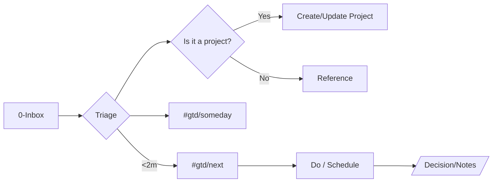

# Planning 001 — Obsidian Vault: Workflows & Automation

> [!summary] TL;DR
> A maintainable, **no-external-APIs** Obsidian system with: clear Git workflow; pre-commit quality gates; QuickAdd + Templater automations (Projects, Meetings, People, Decision Log); **weekly & monthly GTD reviews**; Dataview dashboards; living documentation and procedures.

---

## Table of Contents
- [[#Goals & Principles]]
- [[#Vault Structure (Hybrid PARA + Zettelkasten)]]
- [[#Conventions & Metadata]]
- [[#Core Workflows]]
  - [[#Task Lifecycle (GTD-ish)]]
  - [[#Project Pipeline]]
  - [[#Knowledge Capture → Zettels]]
  - [[#People / CRM & Meetings]]
  - [[#Weekly & Monthly Reviews]]
- [[#Automation Suite (Local Only)]]
  - [[#QuickAdd Scripts]]
  - [[#Templater Templates]]
  - [[#Dataview Dashboards]]
  - [[#Git Hooks & Quality Gates]]
- [[#Documentation & Procedures]]
- [[#Metrics & Continuous Improvement]]
- [[#Appendix A — Commit & Branching Standards]]
- [[#Appendix B — Example Pre-commit Hook]]

---

## Goals & Principles
- **Keep it simple**: local-only automation. No external apps or APIs.
- **Automation first**: routine tasks handled by scripts/hooks; humans focus on thinking.
- **Consistency**: naming, front matter, folder layout, templates.
- **Quality by default**: linting, formatting, tests via hooks before commit.
- **Living system**: weekly/monthly reviews; continuous improvements.

> [!note] Feasibility
> Broad automation support is **both possible and advisable** with an internal-only approach. Scripts + hooks provide quality gates without cloud services.

---

## Vault Structure (Hybrid PARA + Zettelkasten)
```text
Vault/
├─ 0-Inbox/                      # raw capture (fleeting notes, screenshots, voice-to-text)
├─ 1-Projects/                   # active projects (one note = one project)
│   └─ <Project Name>/
│      ├─ Project.md             # project hub
│      ├─ Decisions/             # decision logs for this project
│      └─ Notes/                 # working notes
├─ 2-Areas/                      # ongoing responsibilities (Health, Finance, Research,…)
├─ 3-Resources/                  # reference material (articles, manuals)
├─ 4-Archive/                    # completed / inactive
├─ People/                       # CRM-style person notes
├─ Meetings/                     # meeting notes (one per interaction)
├─ Templates/                    # Templater & note templates
├─ Scripts/QuickAdd/             # QuickAdd user scripts (JS)
├─ Dashboards/                   # Dataview-driven overview pages
└─ docs/                         # engineering docs & procedures (this file lives here too)
```

> [!tip] PARA + ZK
> Use PARA for **where** notes live, Zettelkasten for **how** ideas evolve (fleeting → literature → permanent). Link aggressively.

---

## Conventions & Metadata
**File naming**
- Projects: `1-Projects/<Project Name>/Project.md`
- Meetings: `Meetings/YYYY/YYYY-MM-DD - <Project> - <Topic>.md`
- People: `People/<Last>, <First>.md`

**Front matter keys (common)**
```yaml
---
type: [project|meeting|person|note]
status: [active|paused|done|someday]
project: "<Project Name>"
people: ["[[Doe, Jane]]", "[[Smith, John]]"]
area: "<Area>"
created: {{date:YYYY-MM-DD}}
updated: {{date:YYYY-MM-DD}}
review: {{date:YYYY-MM-DD}} # next scheduled review
---
```

**Tags**
- `#gtd/inbox`, `#gtd/next`, `#gtd/waiting`, `#gtd/someday`
- `#meeting`, `#decision`, `#project`, `#area/<name>`

---

## Core Workflows

### Task Lifecycle (GTD-ish)

Checklist:
- [ ] Empty **0-Inbox** daily.
- [ ] Convert multi-step items into Projects.
- [ ] Tag single-step items with `#gtd/next` or schedule.

### Project Pipeline
Statuses: `idea → planned → in-progress → review → done`  
Each **Project.md** contains: Scope, Definition of Done, Risks, Links, Decision log.

### Knowledge Capture → Zettels
- Fleeting notes → literature notes (with cite) → **permanent notes** with one atomic idea.
- Always link: `[[Permanent Note Title]]` ↔ `[[Project.md]]`.

### People / CRM & Meetings
- One note per person in `People/` with relationships and interactions.
- Each meeting becomes a note under `Meetings/` and links to `people` + `project`.

### Weekly & Monthly Reviews
**Weekly (15–30m, e.g., Friday 16:00):**
- [ ] Review `#gtd/waiting` and `#gtd/next`.
- [ ] Update projects; close stale tasks; log decisions.
- [ ] Capture metrics snapshot (warnings, tests, PR cycle time).

**Monthly (60m, last workday):**
- [ ] Assess goals vs. outcomes; choose improvement experiments.
- [ ] Review quality metrics; set targets.
- [ ] Update procedures & templates.

---

## Automation Suite (Local Only)

> [!important] Philosophy
> **Run locally, commit often, gate quality before merge.** No cloud CI required to start.

### QuickAdd Scripts
Place JS files in `Scripts/QuickAdd/` and wire them via **QuickAdd → Macros**.

#### 1) `new_project.js`
```javascript
// Scripts/QuickAdd/new_project.js
// Creates a project hub with folders, front matter, and seed sections.
module.exports = async (params) => {
  const { app, quickAddApi: qa, moment } = params;
  const name = await qa.inputPrompt("Project name?");
  if (!name) return qa.notice("Cancelled");
  const base = `1-Projects/${name}`;
  const files = {
    hub: `${base}/Project.md`,
    decisions: `${base}/Decisions/README.md`,
    notes: `${base}/Notes/README.md`
  };
  // Ensure folders
  for (const p of [base, `${base}/Decisions`, `${base}/Notes`]) {
    if (!(await app.vault.adapter.exists(p))) await app.vault.createFolder(p);
  }
  // Create hub if missing
  if (!(await app.vault.adapter.exists(files.hub))) {
    const content = `---\n`+
`type: project\nstatus: active\nproject: "${name}"\ncreated: ${moment().format("YYYY-MM-DD")}\nupdated: ${moment().format("YYYY-MM-DD")}\nreview: ${moment().add(7, 'days').format('YYYY-MM-DD')}\n---\n\n# ${name} — Project\n\n> [!info] Definition of Done\n> _Describe measurable completion criteria._\n\n## Scope\n- Goals:\n- Non-Goals:\n\n## Timeline\n- Milestones:\n\n## Risks & Mitigations\n- \n\n## Decision Log\n- See [[Decisions|Decisions/]]\n\n## Links\n- Related: \n`;
    await app.vault.create(files.hub, content);
  }
  // Decision/Notes seed
  if (!(await app.vault.adapter.exists(files.decisions))) {
    await app.vault.create(files.decisions, `# Decisions for ${name}\n`);
  }
  if (!(await app.vault.adapter.exists(files.notes))) {
    await app.vault.create(files.notes, `# Working Notes for ${name}\n`);
  }
  await qa.openFile(files.hub);
  qa.notice(`Project created: ${name}`);
};
```

#### 2) `new_meeting.js`
```javascript
// Scripts/QuickAdd/new_meeting.js
module.exports = async ({ app, quickAddApi: qa, moment }) => {
  const project = await qa.suggester(app.vault.getAllLoadedFiles()
    .filter(f => f.path.startsWith("1-Projects/") && f.path.endsWith("/Project.md"))
    .map(f => f.path.replace("1-Projects/", "").replace("/Project.md", "")),
    null, "Project?");
  const topic = await qa.inputPrompt("Topic?");
  const persons = await qa.inputPrompt("People (comma-separated, match People/ notes)?");
  const dt = moment();
  const fileName = `${dt.format('YYYY')}/${dt.format('YYYY-MM-DD')} - ${project} - ${topic}.md`;
  const path = `Meetings/${fileName}`;
  const peopleLinks = persons ? persons.split(",").map(s=>s.trim()).filter(Boolean).map(n => `[[${n}]]`).join(", ") : "";
  const fm = `---\n`+
`type: meeting\nproject: "${project}"\npeople: [${peopleLinks}]\ncreated: ${dt.format('YYYY-MM-DD')}\nupdated: ${dt.format('YYYY-MM-DD')}\n---\n`;
  const body = `${fm}\n# ${topic} — ${project}\n\n> [!meeting] Logistics\n> **When:** ${dt.format('YYYY-MM-DD HH:mm')}  \\
> **Who:** ${peopleLinks}\n\n## Agenda\n- \n\n## Notes\n- \n\n## Actions\n- [ ] Owner — Task\n`;
  // Ensure year folder
  const yearFolder = `Meetings/${dt.format('YYYY')}`;
  if (!(await app.vault.adapter.exists(yearFolder))) await app.vault.createFolder(yearFolder);
  await app.vault.create(path, body);
  qa.openFile(path);
  qa.notice(`Meeting created: ${path}`);
};
```

#### 3) `new_person.js`
```javascript
// Scripts/QuickAdd/new_person.js
module.exports = async ({ app, quickAddApi: qa, moment }) => {
  const last = await qa.inputPrompt("Last name?");
  const first = await qa.inputPrompt("First name?");
  if (!last || !first) return qa.notice("Cancelled");
  const title = `${last}, ${first}`;
  const path = `People/${title}.md`;
  if (await app.vault.adapter.exists(path)) {
    qa.notice("Person already exists");
    return qa.openFile(path);
  }
  const content = `---\n`+
`type: person\nstatus: active\ncreated: ${moment().format('YYYY-MM-DD')}\nupdated: ${moment().format('YYYY-MM-DD')}\n---\n\n# ${title}\n\n## Contact\n- Email: \n- Phone: \n- Location: \n\n## Relationships\n- Company: \n- Role: \n\n## Interactions\n- See [[Meetings]]\n`;
  await app.vault.create(path, content);
  qa.openFile(path);
};
```

#### 4) `decision_log.js`
```javascript
// Scripts/QuickAdd/decision_log.js
// Adds a dated decision entry to the current project's Decisions folder.
module.exports = async ({ app, quickAddApi: qa, moment }) => {
  const active = app.workspace.getActiveFile();
  if (!active) return qa.notice("Open a project file first");
  const projectRoot = active.path.split("/Project.md")[0];
  if (!projectRoot || !active.path.endsWith("Project.md")) return qa.notice("Not a Project.md");
  const dPath = `${projectRoot}/Decisions/${moment().format('YYYY-MM-DD')}.md`;
  const body = `---\n`+
`type: decision\nproject: "${projectRoot.replace('1-Projects/','')}"\ncreated: ${moment().format('YYYY-MM-DD')}\n---\n\n# Decision — ${moment().format('YYYY-MM-DD')}\n\n## Context\n- \n\n## Decision\n- \n\n## Consequences\n- \n`;
  if (!(await app.vault.adapter.exists(`${projectRoot}/Decisions`))) await app.vault.createFolder(`${projectRoot}/Decisions`);
  await app.vault.create(dPath, body);
  qa.openFile(dPath);
};
```

> [!example] QuickAdd Macro Wiring
> - **New Project** → `Script: Scripts/QuickAdd/new_project.js`
> - **New Meeting** → `Script: Scripts/QuickAdd/new_meeting.js`
> - **New Person** → `Script: Scripts/QuickAdd/new_person.js`
> - **Decision Log Entry** → `Script: Scripts/QuickAdd/decision_log.js`

---

### Templater Templates
Store under `Templates/`.

#### Daily Note — `Templates/Daily.md`
```markdown
---
created: <% tp.date.now("YYYY-MM-DD") %>
updated: <% tp.date.now("YYYY-MM-DD") %>
---
# <% tp.date.now("YYYY-MM-DD, ddd") %>

## Top 3
- [ ] 1
- [ ] 2
- [ ] 3

## Log
- <% tp.date.now("HH:mm") %> — 

## Inbox
- [ ] 
```

#### Meeting — `Templates/Meeting.md`
```markdown
---
type: meeting
project: "<%* tR = tp.frontmatter()["project"] ?? "" %><% tR %>"
people: []
created: <% tp.date.now("YYYY-MM-DD") %>
updated: <% tp.date.now("YYYY-MM-DD") %>
---
# <% tp.file.title %>

> [!meeting] Logistics
> **When:** <% tp.date.now("YYYY-MM-DD HH:mm") %>  \\
> **Who:** 

## Agenda
- 

## Notes
- 

## Actions
- [ ] 
```

#### Weekly Review — `Templates/Weekly Review.md`
```markdown
---
type: review
scope: weekly
week: <% tp.date.now("gggg-[W]ww") %>
created: <% tp.date.now("YYYY-MM-DD") %>
---
# Weekly Review — <% tp.date.now("gggg-[W]ww") %>

## Wins
- 

## Projects — status changes
- 

## Waiting / Blocks
- 

## Improvements (pick 1–2 experiments)
- 
```

#### Monthly Review — `Templates/Monthly Review.md`
```markdown
---
type: review
scope: monthly
month: <% tp.date.now("YYYY-MM") %>
created: <% tp.date.now("YYYY-MM-DD") %>
---
# Monthly Review — <% tp.date.now("YYYY-MM") %>

## Outcomes vs. Goals
- 

## Metrics snapshot
- Coverage / Lint warnings / PR cycle time: 

## Process changes agreed
- 
```

---

### Dataview Dashboards
Create `Dashboards/Control Panel.md`:
```markdown
# Control Panel

## Active Projects
```dataview
TABLE status, review, file.link AS Project
FROM "1-Projects"
WHERE file.name = "Project" AND status != "done"
SORT status, review asc
```

## Next Actions
```dataview
TASK FROM "1-Projects"
WHERE !completed AND contains(tags, "gtd/next")
SORT due asc
```

## Upcoming Meetings (±30 days)
```dataview
TABLE date, project, people
FROM "Meetings"
WHERE date >= date(today) - dur(1 days) AND date <= date(today) + dur(30 days)
SORT date asc
```
```

> [!tip]
> Use **DataviewJS** if you need richer grouping or custom sorting.

---

### Git Hooks & Quality Gates
- **Style**: adopt Google-style (language-appropriate) format/lint configs.
- **Tests**: run locally before commit/merge; failing tests block merges.
- **Branch protection** (optional, if remote supports it): require PR + reviews.

> [!warning] Keep hooks fast
> Lint only changed files; run targeted tests where possible.

---

## Documentation & Procedures
- Keep docs alongside code in `docs/`.
- Every feature PR: update docs + templates when behavior changes.
- Maintain **Contributor Guide** and **Release Guide** (checklists!).

**In-code documentation**: prefer concise docstrings on public functions & non-obvious logic.

---

## Metrics & Continuous Improvement
Track monthly (manually or via script):
- Lint warnings ↓, Test coverage ↑, Avg PR review time ↓, Open bugs ↓.
- Record snapshots in Monthly Review.

**Weekly**: short log of decisions, blockers, and actions.

---

## Appendix A — Commit & Branching Standards

**Branching**
- `main`: stable
- `feature/<slug>`: new work
- `fix/<slug>`: bugfixes
- `docs/<slug>`: documentation-only

**Conventional Commit-like prefixes**
| Type | Meaning |
|---|---|
| feat | user-facing feature |
| fix | bug fix |
| docs | documentation |
| refactor | code change w/o behavior change |
| test | add/adjust tests |
| chore | tooling, build, deps |

Example: `feat(projects): add decision log template`

---

## Appendix B — Example Pre-commit Hook
Create `.git/hooks/pre-commit` (make executable):
```bash
#!/usr/bin/env bash
set -euo pipefail

# Example: JS/TS project; adapt as needed.
if command -v npm >/dev/null 2>&1; then
  echo "▶ Linting staged files"
  npx eslint --max-warnings=0 $(git diff --cached --name-only --diff-filter=ACM | grep -E '\\.(js|ts|tsx)$' || true)
  echo "▶ Running tests"
  npm test --silent
fi

# Example: Python
if command -v uv >/dev/null 2>&1; then
  echo "▶ Python lint + tests"
  uv run ruff check .
  uv run pytest -q
fi

echo "✔ Pre-commit checks passed"
```

> [!success]
> Hooks + local scripts enable **quality gates** without any external CI.

---

## Why this works (recap)
- **Automation Strategy**: unit/integration tests, local CI scripts, pre-commit hooks, style enforcement, build scripts — all internal.
- **Coding Standards & QA**: living standards, static analysis, peer reviews with checklists, test discipline (>90% on core modules where practical).
- **Documentation & Knowledge Sharing**: README + feature docs; procedure guides; mentoring through reviews; FAQs.
- **Review Cadence**: weekly micro-retros; monthly strategic review with metrics + action items.

> [!quote]
> "Make the easy things automatic and the hard things obvious."